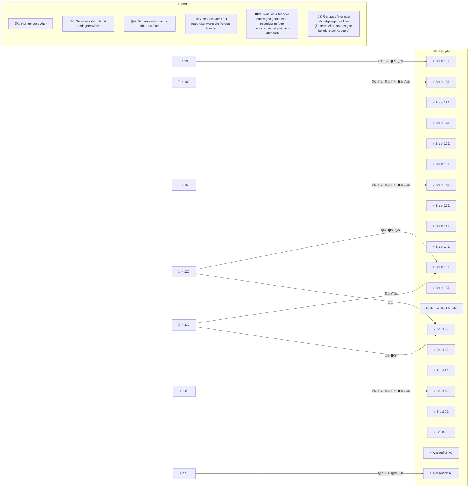

#  Vereinsmeisterschaften

Programm für die Vereinsmeisterschaften der Schwimmabteilung des TSV Illertissen. Folgende Funktionen sind enthalten:
- Verwaltung von Meldungen
- Verwaltung von Wettkämpfen
- Automatische oder manuelle Erstellung von Rennabläufen
- Eingabe der erschwommenen Zeiten
- Auswertung der Ergebnisse
- Erstellung von Dokumenten (Startlisten, Urkunden, Ergebnislisten, ...)

## Erste Inbetriebnahme ("Installation")

Die Software benötigt keine Installation im klassischen Sinne. Es muss lediglich die .exe Datei entpackt werden.

1. [Aktuellstes Release herunterladen](https://github.com/M1S2/Vereinsmeisterschaften/releases/latest).
2. Die heruntergeladene .zip Datei an einen beliebigen Ort entpacken.
3. Die Datei `Vereinsmeisterschaften.exe` im entpackten Ordner ausführen.
4. Nach dem ersten Start einen Arbeitsbereich auswählen oder einen neuen Ordner anlegen und dann auswählen.

## Seiten Beschreibung
Nachfolgend werden kurz die Funktionen der jeweiligen Seite der Anwendung beschrieben. Die Reihenfolge der Seiten spiegelt ungefähr den gesamten Workflow wieder (von der Eingabe der Meldungen, über die Eingabe der Zeiten während des Wettkampfs bis zur Auswertung).

### Start
Startseite, von der auf alle anderen Bereiche zugegriffen werden kann. Gleichwertig mit dem Menü am linken Rand.

</img>

### Arbeitsbereich
Hier kann der aktuelle Ordner des Arbeitsbereichs (mehr Details siehe unten) ausgewählt und alle Änderungen gespeichert werden.
Außerdem können alle Einstellungen für verschiedene Aspekte der Software hier getroffen und auch wieder zurückgesetzt werden.

</img>

### Wettkämpfe
Hier werden alle verfügbaren Wettkämpfe definiert. Ein Wettkampf wird beschrieben über die Lage, die Strecke, das Alter und eine entsprechende Zeit.
Die Zeit wird dann für die Berechnung der Punkte her genommen. Wird exakt die hier eingetragene Zeit erschwommen, gibt es 100 Punkte. Wenn langsamer gibt es weniger Punkte, wenn schneller dann mehr.
Für jeden Start einer Person muss auch ein entsprechender Wettkampf verfügbar sein.

</img>

### Meldungen
Hier können alle Meldungen eingetragen werden. Für die Meldung ist der Name, der Jahrgang und die gewünschten Lagen nötig. Für jede Lage muss auch ein entsprechender Wettkampf hinterlegt sein! Sonst wird der Start ignoriert (wird hier auch farblich markiert).

</img>

### Rennen vorbereiten
Hier kann eine Reihenfolge für die Starts erstellt werden. Entweder manuell per Hand (Variante hinzufügen und die Starts per Hand vom rechten Bereich in die Mitte ziehen) oder automatisch (es werden zufällig Varianten erstellt und nach verschiedenen Kriterien bewertet).

Jede Variante eines Rennens wird von 0% (schlecht) bis 100% (perfekt) bewertet. Im Arbeitsbereich kann die Gewichtung oder verschiedene Parameter für die automatische Berechnung eingestellt werden.

Es gibt auch die Möglichkeit, bestimmte Starts hervorzuheben. Z.B. alle Starts einer Person um zu schauen, ob genügend Pausen vorhanden sind.

</img>

### Zeiten eingeben
Für jeden Start kann hier die erschwommene Zeit eingetragen werden (in Minute, Sekunden und Zehntelsekunden). Es stehen verschiedene Filtermöglichkeiten zur Verfügung.

</img>

### Ergebnisse
Hier wird die Auswertung aus allen Starts angezeigt (wie viele Punkte die jeweils erschwommenen Zeiten ergeben). Es ist möglich, auch die besten Schwimmer in einer bestimmten Lage zu ermitteln.

</img>

### Dokumente erstellen
Hier können verschiedene Dokumente erstellt werden, die vor, während oder nach dem Wettkampf nötig sind.

Außerdem ist eine Übersicht über alle verfügbaren Platzhalter vorhanden, die in den Dokumenten verwendet werden können.

</img>

### Analysen
Auf dieser Seite werden verschiedene Analysen dargestellt. Diese Analysen hängen von verschiedenen Daten ab, die auf den anderen Seiten eingegeben wurden.
Infos zu den einzelnen Analysen:
- **Anzahl Personen:** Analysieren, wie viele Personen gemeldet sind (aktiv und inaktiv).
- **Geschlechterverteilung der aktiven Personen:** Analysieren, wie viel Prozent der Personen männlich bzw. weiblich sind. Nur aktive Personen werden gezählt.
- **Anzahl Starts:** Analysieren, wie viele Starts gemeldet sind (aktiv und inaktiv).
- **Geschlechterverteilung der gültigen Starts:** Analysieren, wie viel Prozent der Starts männlich bzw. weiblich sind. Nur gültige Starts werden gezählt (aktiv und mit zugewiesenem Wettkampf).
- **Anzahl von gültigen Starts pro Stil:** Analysieren, wie viele Starts pro Schwimmstil gemeldet sind. Nur gültige Starts werden gezählt (aktiv und mit zugewiesenem Wettkampf).
- **Anzahl von gültigen Starts pro Distanz:** Analysieren, wie viele Starts pro Distanz gemeldet sind. Nur gültige Starts werden gezählt (aktiv und mit zugewiesenem Wettkampf).
- **Anzahl Personen pro Geburtsjahr:** Analysieren, wie viele Personen pro Geburtsjahr gestartet sind. Nur aktive Personen werden gezählt.
- **Anzahl an gültigen Starts pro Person:** Analysieren, wie viele Starts jede Person hat. Nur gültige Starts werden gezählt (aktiv und mit zugewiesenem Wettkampf).
- **Abstände zwischen den Starts einer Person:** Analysieren, wie viel Pause zwischen den Starts einer Person ist. Nur aktive Starts werden gezählt.
- **Geburtsjahr je Platz im Gesamtergebnis:** Analysieren, welches Geburtsjahr für jeden Platz im Gesamtergebnis zugeordnet ist.
- **Geburtsjahre je Rennen:** Analysieren, welche Geburtsjahre je Rennen antreten.

TBD: Bild der Seite .................

### Einstellungen
Hier kann das Software Design verändert werden. Hell, Dunkel oder Systemeinstellung stehen zur Verfügung.

</img>

## Arbeitsbereich
Der Arbeitsbereich ist ein Ordner, in dem alle Einstellungen, Wettkämpfe und Meldungen gespeichert werden. Hier bietet es sich an, für jeden Wettkampf (z.B. jedes Jahr) einen neuen Ordner anzulegen. Es ist egal, wo sich der Ordner auf der Festplatte befindet.

Folgende Dateien werden erzeugt:
- WorkspaceSettings.json: JSON Datei mit allen Einstellungen für den Arbeitsbereich. Dieser Dateiname ist fix.
- Personen.csv / Person.csv: Liste mit allen Meldungen und den erschwommenen Zeiten.
- Wettkaempfe.csv / Competitions.csv: Liste mit allen verfügbaren Wettkämpfen.
- BestesRennen.csv / BestRace.csv: Das Rennen, das als gute Variante markiert wurde, wird hier gespeichert. Wenn kein Rennen markiert wurde, existiert diese Datei nicht.

Die Dateinamen werden folgendermaßen ermittelt:
- Beim Laden des Arbeitsbereichs wird die Datei der aktuellen Systemsprache verwendet (wenn verfügbar). Wenn nicht verfügbar, wird die neueste Datei aus allen verfügbaren Sprachen (momentan Deutsch und Englisch) verwendet.
- Beim Speichern des Arbeitsbereichs wird immer die aktuelle Systemsprache verwendet. Sollte der Arbeitsbereich mit einer Datei einer anderen Sprache geladen worden sein, wird die alte Datei gelöscht und die neue Datei in Systemsprache abgespeichert.

Bei den Datei-Inhalten gilt die gleiche Logik wie beim Dateinamen. Beim Laden wird z.B. "Brust" und "Breaststroke" beim Stil unterstützt. Beim Abspeichern wird z.B. immer "Brust" geschrieben, wenn die Systemsprache Deutsch ist.

Es können hier natürlich weitere Dateien abgelegt werden (z.B. Templates).

## Punktewertung
Die Punkte eines Starts werden folgendermaßen berechnet:
- Folgende Formel wird verwendet: `Punkte = (2 - (ErschwommeneZeit / WettkampfVorgabeZeit)) * 100;`
- Wird exakt die Zeit des hinterlegten Wettkampfs erschwommen (ErschwommeneZeit == WettkampfVorgabeZeit), gibt es 100 Punkte.
- Wenn langsamer dann gibt es weniger Punkte.
- Wenn schneller dann gibt es mehr Punkte.
- Null Punkte, sobald `ErschwommeneZeit >= 2 * WettkampfVorgabeZeit`

Der Start mit der höchsten Punktezahl wird als "Bestes Rennen" gewertet und für die Gesamtwertung herangezogen. Es wird kein Durchschnitt gebildet.

## Wettkampf Zuordnung
Jeder Start einer Person muss einem Wettkampf zugeordnet werden. Dies geschieht abhängig vom gewählten Modus. Folgendes Diagramm zeigt exemplarisch die Zuordnung für Brust Starts (Wasserflöhe werden immer dem ersten gefundenen Wasserfloh-Wettkampf zugeordnet):

## Entwickler Dokumentation
Detailliertere Entwickler Dokumentation: https://m1s2.github.io/Vereinsmeisterschaften

## Icons
- SwimmingStyles.png: https://www.vecteezy.com/vector-art/349116-swimming-aqua-aquatic-sport-game-icon-symbol-sign-pictogram
- icons8-child-64.png: https://icons8.com/icon/67246/babys-room
- Geometry_Female: https://pictogrammers.com/library/mdi/icon/gender-female/
- Geometry_Male: https://pictogrammers.com/library/mdi/icon/gender-male/
- Geometry_DecimalComma: https://pictogrammers.com/library/mdi/icon/decimal-comma/
- Geometry_Counter: https://pictogrammers.com/library/mdi/icon/counter/
- Geometry_Weight: https://pictogrammers.com/library/mdi/icon/weight/
- Geometry_Priority: https://pictogrammers.com/library/mdi/icon/priority-high/
- Geometry_Trophy: https://pictogrammers.com/library/mdi/icon/trophy-outline/_
- Geometry_AccountTie: https://pictogrammers.com/library/mdi/icon/account-tie/

https://retouchinglabs.com/inkscape-convert-png-to-svg/
https://stackoverflow.com/questions/18624070/convert-svg-to-xaml